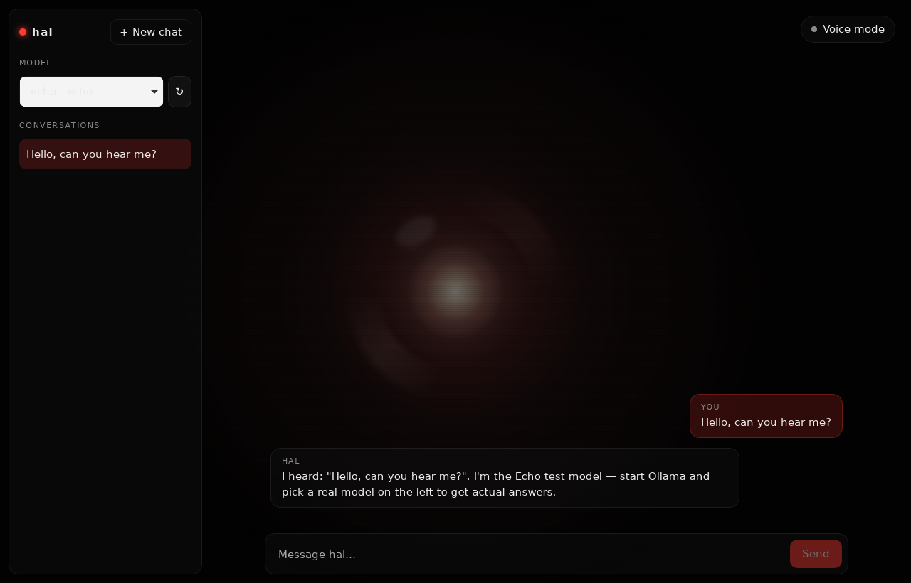
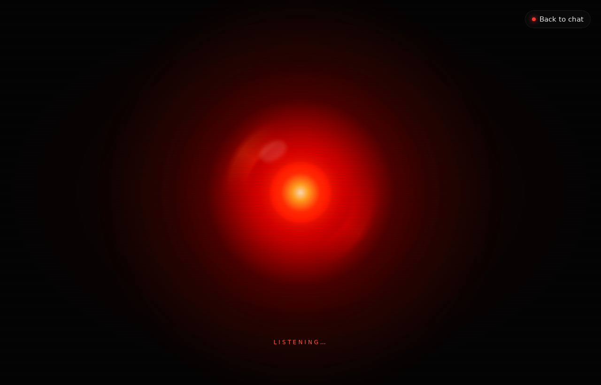

HAL

A personal, local-first AI assistant written entirely in Rust.

HAL is a desktop chat assistant built with Dioxus that talks to AI models running on your own hardware through Ollama. Its interface is inspired by HAL 9000 from 2001: A Space Odyssey: a glowing red orb that sits behind glass panels and reacts when you speak to it.

It's the first stage of a larger home AI system. The long-term goal is one assistant that can be reached from any device (desktop, iPad, phone) and can handle real tasks like monitoring security cameras, checking email, and running automated workflows.

    <em>Chat mode: conversation history, model picker, and streaming replies over the orb.</em> 
 
    <em>Voice mode: the panels fade away and the orb wakes up and reacts to audio level.</em> 

Features
100% Rust — frontend and backend, no JavaScript framework.
Runs offline — models run locally through Ollama. After the one-time model download, no internet is needed and chats never leave your machine.
Swappable models — every model sits behind a single LlmProvider trait. Pick any installed Ollama model from the dropdown, or add a new provider in one file.
Streaming replies — responses appear token by token as the model generates them.
Conversation history — multiple chats in the sidebar, auto-titled from the first message.
Chat / voice toggle — switch modes from the top-right button. The UI stays mounted, so nothing is lost when switching.
Animated orb — layered CSS gradients, blur, and out-of-sync animations that make it feel alive, with a live --level variable driving its reaction to voice.
Glass UI — translucent panels using backdrop-filter so the orb glows through.
Offline fallback — a built-in Echo provider lets you test the app with no model installed.
Getting started
Requirements
Tool	Why	Install
Rust (stable)	Builds the app	https://rustup.rs
Dioxus CLI	Runs and bundles the app with its CSS	cargo install dioxus-cli
Ollama	Runs AI models locally	https://ollama.com
1. Get a model
bash
ollama pull llama3.2

This is a free ~2 GB download. Any Ollama model works; smaller ones run faster on modest hardware. A GPU (NVIDIA works best) speeds things up a lot, but CPU works too.

2. Run HAL
bash
git clone https://github.com/ng-hue/hal.git
cd hal
dx serve

Use dx serve, not cargo run. dx is what bundles assets/main.css; with plain cargo run the app opens unstyled.

3. Pick your model

Make sure Ollama is running, press ↻ next to the model list, and select llama3.2 · ollama. If Ollama isn't running, HAL falls back to the Echo test model.

Other commands
Command	What it does
cargo test	Runs the engine tests (stream parsing, echo provider, titles)
dx bundle	Builds a release installer
How it works
 ┌──────────────── Dioxus UI (src/components) ────────────────┐
 │  sidebar · model picker · chat view · input bar · orb      │
 └──────────────┬─────────────────────────────────────────────┘
                │ signals (src/state.rs)
                ▼
        src/actions.rs   ── send_message / refresh_models
                │
                ▼
 ┌──────────────── engine (src/engine) — no UI code ──────────┐
 │  Conversation ─► ProviderRegistry ─► LlmProvider           │
 │                                      ├─ OllamaProvider ────┼──► http://localhost:11434
 │                                      └─ EchoProvider       │
 └────────────────────────────────────────────────────────────┘
You type a message; input_bar.rs calls send_message in actions.rs.
The message is added to the current Conversation and handed to the ProviderRegistry.
The registry routes it to the selected provider. The Ollama provider sends an HTTP request to the local Ollama service and parses its streaming NDJSON response.
Each chunk is pushed into a Dioxus signal, so the reply renders live as it streams in.

Model discovery works the same way: refresh_models asks Ollama's API which models are installed. HAL never scans folders on disk.

The visual effects

Everything visual lives in assets/main.css. Rust only switches classes and passes one number.

Orb: five stacked, blurred radial-gradient layers (outer haze, red glow, rotating ring of streaks, hot core, highlight) plus faint scanlines.
Motion: each layer has its own @keyframes with mismatched durations (3.1s, 5.3s, 7.3s, 19s), so they never loop in sync.
Mode change: Rust swaps orb--dim and orb--awake, with a 1.2s transition between them.
Voice reaction: voice.rs updates a --level CSS variable ~30 times per second, which scales and brightens the orb.
Glass panels: semi-transparent backgrounds with backdrop-filter: blur().
Project layout
hal/
├── Cargo.toml / Dioxus.toml   # project + Dioxus config
├── assets/main.css            # all styling, including the orb
├── docs/screenshots/          # images used in this README
└── src/
    ├── main.rs                # window setup + root layout
    ├── state.rs               # AppState (signals), Mode, model registration
    ├── actions.rs             # send_message, refresh_models
    ├── voice.rs               # voice-mode engine (stub for now)
    ├── components/            # UI, one file per component
    │   ├── orb.rs             # animated background
    │   ├── mode_toggle.rs     # chat/voice button
    │   ├── sidebar.rs         # brand, new chat, history
    │   ├── model_picker.rs    # model dropdown + refresh
    │   ├── chat_view.rs       # scrolling messages
    │   ├── message_bubble.rs  # single message
    │   └── input_bar.rs       # text box, send, error banner
    └── engine/                # the "brain" — no Dioxus code allowed
        ├── mod.rs
        ├── conversation.rs    # Role, Message, Conversation (serde-ready)
        └── llm/
            ├── mod.rs         # LlmProvider trait, ModelRef, LlmError
            ├── registry.rs    # ProviderRegistry: holds providers, routes chats
            ├── ollama.rs      # Ollama provider (streaming NDJSON)
            └── echo.rs        # offline test provider
Why keep engine/ UI-free?

It keeps future options open. When HAL grows a home server that owns the cameras, email, and automation, src/engine/ moves into its own crate in a Cargo workspace, and both the server and this app depend on it. Because engine never imports Dioxus, that move is just a folder copy and a few use path changes.

Rule of thumb: if the code doesn't draw pixels, it belongs in engine/.

Adding a new model provider
Create src/engine/llm/my_provider.rs and implement the LlmProvider trait (list models, stream a chat).
Export it from src/engine/llm/mod.rs.
Register it in src/state.rs alongside Ollama and Echo.

It then shows up in the model picker automatically.

Roadmap
 Desktop chat UI with streaming replies
 Swappable model providers (Ollama + Echo)
 Conversation history
 Animated orb + chat/voice mode toggle
 Real voice pipeline (mic input, speech-to-text, text-to-speech)
 System prompt / HAL personality
 Stop button while a reply streams
 Markdown and code-block rendering
 Save conversations to disk
 Split engine/ into its own crate and add a home server
 iPad / mobile client
 Integrations: security cameras, email, automated tasks
Built with
Rust
Dioxus 0.7 — cross-platform UI
Ollama — local model runtime
Tokio — async runtime